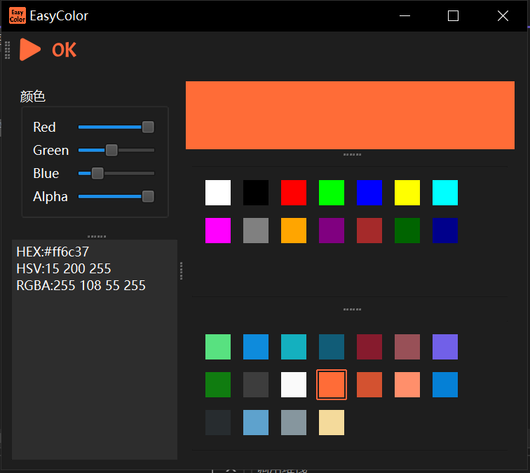

# Easy 系列软件

## EasyColor
### 软件特性
> 捕获屏幕任意位置的颜色值 
> 
> 支持不同的颜色表示方式（如 RGB、HEX、HSL）
>
> 颜色值动态调整
>
> 提供常用的14中颜色
>
> 高分辨率显示器适配
>
> 多屏幕显示器适配
>
> 颜色选取历史记录,支持通过点击切换之前选择过的颜色【暂未序列化到本地】

### 软件使用方法
使用快捷键进行屏幕颜色的选取

**Ctrl+S** 开始选择颜色

**Ctrl+D** 完成颜色选取

颜色选取完成后，可以进行颜色的调整

### 软件截图

